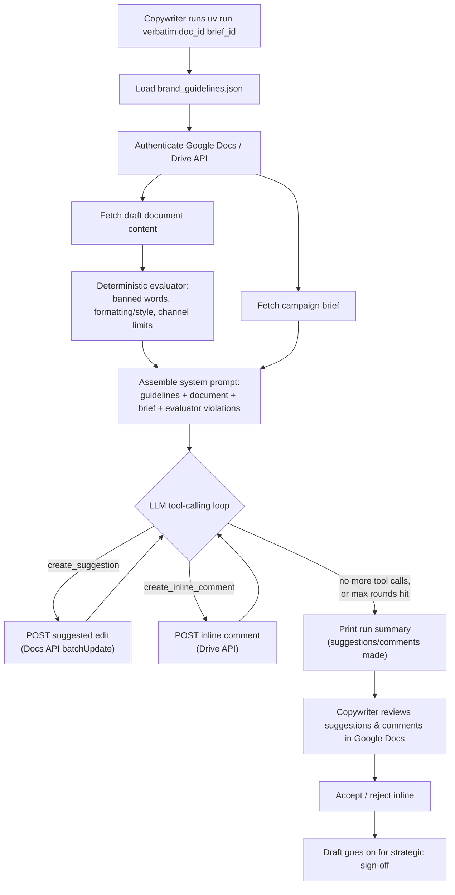

# Verbatim

Verbatim is an AI agent that reviews draft marketing copy inside Google Docs against a brand's voice, style, and structural guidelines and a campaign brief. It runs on-demand when a copywriter starts a check, then flags mechanical issues — tone drift, information hierarchy, CTA cadence, readability, formatting/style, channel constraints, and banned words — as inline comments and suggested edits directly in the document.

## Table of contents

- [Verbatim](#verbatim)
  - [Table of contents](#table-of-contents)
  - [How it works](#how-it-works)
  - [Design notes](#design-notes)
  - [Current sprint](#current-sprint)
  - [Team & responsibilities](#team--responsibilities)
  - [Prerequisites](#prerequisites)
  - [macOS setup](#macos-setup)
  - [Windows setup](#windows-setup)
  - [Clone & bootstrap](#clone--bootstrap)
  - [Common commands](#common-commands)
  - [Development workflow](#development-workflow)
  - [Google Docs API setup](#google-docs-api-setup)
  - [Agent (OpenRouter) setup](#agent-openrouter-setup)
  - [CLI usage](#cli-usage)
  - [Project structure](#project-structure)
  - [Versioning](#versioning)
  - [License](#license)

## How it works

A copywriter kicks off a check from the command line against a draft document and its campaign brief. From there the run is fully automated: Verbatim reads both documents, runs its deterministic rule checks, hands everything to the LLM as context, and lets the model post suggestions/comments directly back into the doc. Nothing is written until the copywriter reviews it.



The evaluator and the LLM cover different halves of the 7 audit categories: `BrandGuidelinesEvaluator` handles the mechanically-checkable ones (banned words, formatting/style mechanics, channel constraints) with plain regex, while the model handles the four requiring subjective judgment (tone drift, information hierarchy, CTA cadence, readability) — using the evaluator's findings as extra citable context rather than needing to reproduce them itself.

## Design notes

A few things about how this was built that might be worth stealing if you're building something similar:

- **Deterministic + LLM hybrid, not LLM-only.** Regex doesn't hallucinate a banned-word match, so `BrandGuidelinesEvaluator` handles every category that's pure pattern-matching without a model call at all. Its findings aren't discarded once computed — they're injected into the LLM's system prompt as pre-verified, citable evidence, so the model spends its judgment budget only on the four genuinely subjective categories instead of re-deriving mechanical checks a regex already nailed. Cheaper, faster, and more reliable than routing everything through the model.
- **The default guidelines are a real style guide, not a toy fixture.** `src/verbatim/data/brand_guidelines.json` is a synthesis of [Mailchimp's public Content Style Guide](https://styleguide.mailchimp.com/) — not a claim about Mailchimp's actual internal rules, just realistic, non-synthetic brand voice/style data to build and demo against. Point `-g/--guidelines` at a different file to audit against a different brand.
- **A knowledge base written for the coding agent, not just the team.** `.knowledge-base/` decomposes the Google Docs/Drive/OpenRouter REST references into map-and-leaf files (one `MAP.md` index plus a focused leaf per resource, each with a real request/response example and a "Gotchas" section). It exists so an AI coding agent implementing `docs_client.py` doesn't have to re-fetch Google's live docs — or worse, hallucinate a plausible-looking field name — every session. Scoped strictly to endpoints actually called; a new endpoint gets a new leaf rather than a cold read of the live reference.
- **"Suggested edit" requires Suggester access, not Editor.** `create_suggestion` only lands as a reviewable suggestion — the entire point, since nothing should reach the document unreviewed — if the authenticated account has Commenter/Suggester (not Editor) permission on the target doc. Editor access makes the identical API call apply the edit directly and silently instead. Found by testing against a live doc; it isn't called out anywhere obvious in Google's docs.
- **The narrower Drive scope 404s on this project's exact use case.** `drive.file` only covers files the app itself created or the user picked via a file picker — it 404s on `comments.create` for a doc a copywriter just opens by link, which is Verbatim's whole workflow. `WRITE_SCOPES` requests the broader `drive` scope instead, confirmed live rather than assumed from the scope reference.

## Current sprint

See [`TODO.md`](TODO.md) for the active sprint plan — the current deadline, the day-by-day work split between Karl and Christina, and which files/components each of them (and their coding agents) should be working in.

## Team & responsibilities

Karl and Christina split ownership of the repo by domain, not by day-to-day task, so each of them can move fast without waiting on review of the other's in-flight work — the two stay in disjoint files at any given time:

- **Christina** owns the deterministic rules/evaluator engine: `src/verbatim/evaluator.py`, `src/verbatim/brand_guidelines.py`, `src/verbatim/data/brand_guidelines.json`, and their tests. This covers the mechanically-checkable brand rules — banned words, formatting/style mechanics, channel character/sentence limits, standardized spellings.
- **Karl** owns infrastructure/CI/tooling, the Google Docs/Drive API client (`src/verbatim/docs_client.py`), and the LLM agent loop and prompt assembly (`src/verbatim/agent.py`, `src/verbatim/prompt.py`, `src/verbatim/cli.py`).

This split isn't permanent. Christina's domain was chosen deliberately: it's self-contained and regex/pattern-based with a fast TDD feedback loop, which gives her genuine ownership of core product logic rather than docs/config busywork. She'll rotate into Docs API and agent-loop territory in small, reviewed slices as time allows, rather than all at once. See [`TODO.md`](TODO.md) for the current sprint's day-by-day split and file ownership map.

## Prerequisites

This project is managed end-to-end by [`uv`](https://docs.astral.sh/uv/), which installs and pins the right Python version for you — you do not need to install Python separately. You do need `git` and `uv` themselves; setup steps for each OS are below.

## macOS setup

1. Install [Homebrew](https://brew.sh) if you don't already have it.

1. Install git:

   ```sh
   brew install git
   ```

1. Install `uv`:

   ```sh
   curl -LsSf https://astral.sh/uv/install.sh | sh
   ```

1. Restart your terminal, then install the project's Python version:

   ```sh
   uv python install 3.12
   ```

## Windows setup

1. Install git via [winget](https://learn.microsoft.com/en-us/windows/package-manager/winget/):

   ```powershell
   winget install --id Git.Git -e --source winget
   ```

1. Install `uv` (official PowerShell installer):

   ```powershell
   powershell -ExecutionPolicy ByPass -c "irm https://astral.sh/uv/install.ps1 | iex"
   ```

1. Restart your terminal, then install the project's Python version:

   ```powershell
   uv python install 3.12
   ```

## Clone & bootstrap

```sh
git clone <repo-url>
cd verbatim
uv sync
uv run pre-commit install
```

`uv sync` creates a `.venv` and installs every dependency pinned in `uv.lock`. `uv run pre-commit install` wires up the local git hooks (code quality checks on every commit, commit message format checks on every commit message).

## Common commands

Run everything through `uv run` — there's no separate virtualenv to activate.

| Command                             | What it does                                                        |
| ----------------------------------- | ------------------------------------------------------------------- |
| `uv run pytest`                     | Run the test suite with coverage                                    |
| `uv run ruff check .`               | Lint the code                                                       |
| `uv run ruff format .`              | Auto-format the code                                                |
| `uv run mypy`                       | Type-check the code                                                 |
| `uv run pre-commit run --all-files` | Run every pre-commit hook against the whole repo                    |
| `uv run cz commit`                  | Build a Conventional Commits-formatted commit message interactively |

## Development workflow

This project follows **test-driven development**: write a failing test before writing the implementation code that makes it pass. Commit messages (and PR titles once this repo is on GitHub) follow the [Conventional Commits](https://www.conventionalcommits.org/) format (`feat: ...`, `fix: ...`, `chore: ...`, `docs: ...`) — the `commitizen` pre-commit hook enforces this locally, and `uv run cz commit` will build a properly formatted message for you.

## Google Docs API setup

`src/verbatim/docs_client.py` reads documents via the Google Docs API using an OAuth installed-app flow (not a service account — the copywriter checks their own currently-open document, so there's nothing to pre-share). One-time setup to run it locally:

1. Create or select a project in the [Google Cloud Console](https://console.cloud.google.com/).
1. Enable both the **Google Docs API** and the **Google Drive API** for that project — reading a document only needs the Docs API, but posting inline comments (`GoogleDocsClient.create_inline_comment`) goes through the Drive API instead (comments are a Drive resource, not a Docs one).
1. Configure the OAuth consent screen as **External**, in **Testing** mode, and add your own Google account as a test user.
1. Create an OAuth Client ID of type **Desktop app** — this matters, since the installed-app flow's local redirect handling (`InstalledAppFlow.run_local_server`) only works with this client type, not "Web application."
1. Download the client ID's JSON and save it as `client_secret.json` at the repo root (already git-ignored — never commit it).
1. Run anything that calls `GoogleDocsClient.from_local_credentials()`. The first run opens a browser consent prompt; afterward, a `token.json` is cached locally (also git-ignored) so you won't be prompted again until it expires or the requested scopes change. Read-only checks use the default scopes; to also post suggestions/comments, pass `scopes=WRITE_SCOPES, include_drive=True`. For a suggestion to land as a reviewable "Suggested edit" (rather than a silent direct edit), the authenticated account needs Commenter/Suggester — not Editor — access on the target document. `WRITE_SCOPES` requests full `drive` access rather than the narrower `drive.file` — confirmed live that `drive.file` 404s on `comments.create` for any doc the app didn't itself create/open (e.g. a doc opened by URL/link, which is Verbatim's whole use case), regardless of the user's own access to that doc.

See `.knowledge-base/google-docs-api/` and `.knowledge-base/google-drive-api/` for decomposed reference docs on the underlying REST APIs.

## Agent (OpenRouter) setup

`src/verbatim/llm_client.py` runs the audit conversation through [OpenRouter](https://openrouter.ai/)'s OpenAI-compatible chat completions API.

1. Create an OpenRouter account and generate an API key.

1. Copy `.env.example` to `.env` and fill in your key:

   ```sh
   cp .env.example .env
   ```

   `OpenRouterClient.from_env(...)` loads `.env` automatically (it's git-ignored — never commit it). Alternatively, export the variable in your shell instead:

   ```sh
   export OPENROUTER_API_KEY="sk-or-..."
   ```

   On Windows PowerShell: `$env:OPENROUTER_API_KEY = "sk-or-..."`.

## CLI usage

Once bootstrapped and configured, you can run the Verbatim copy auditor directly from your command line:

```sh
uv run verbatim <document_id> <brief_id> [options]
```

### Options

- `-c, --channel`: Optional target marketing channel (e.g. `email`, `blog`, `twitter`). If set, activates channel-specific rules in the evaluator.
- `-m, --model`: OpenRouter model identifier (defaults to `google/gemini-2.5-flash`).
- `-g, --guidelines`: Optional custom path to a `brand_guidelines.json` file.

Example:

```sh
uv run verbatim 1_abc123xyz 1_brief456abc --channel email
```

## Project structure

```text
verbatim/
├── .github/
│   ├── CODEOWNERS
│   └── workflows/
│       └── ci.yml          # lint, type-check, and test on every PR and push to main
├── src/verbatim/           # the installable package
│   ├── __init__.py
│   ├── __main__.py         # runnable module entrypoint
│   ├── agent.py            # single-pass tool-calling agent loop
│   ├── brand_guidelines.py # loader for brand_guidelines.json
│   ├── cli.py              # CLI entrypoint implementation
│   ├── docs_client.py      # Google Docs/Drive API auth + read/write tool wrappers
│   ├── evaluator.py        # BrandGuidelinesEvaluator: checks text against brand rules
│   ├── llm_client.py       # OpenRouter chat-completions client
│   ├── prompt.py           # system prompt assembly + tool schemas
│   ├── py.typed
│   └── data/
│       └── brand_guidelines.json  # brand voice/style rules (Mailchimp style guide synthesis)
├── tests/                  # pytest suite
│   ├── test_agent.py
│   ├── test_cli.py
│   ├── test_docs_client.py
│   ├── test_llm_client.py
│   └── test_prompt.py
├── .knowledge-base/        # decomposed reference docs for external APIs (map-and-leaf)

├── docs/                   # PRD and research reference docs (.docx + Markdown snapshots)
├── .env.example            # OPENROUTER_API_KEY template; copy to .env (git-ignored)
├── BOOTSTRAPPING.md        # scaffolding rationale and remaining setup work
├── CLAUDE.md               # project context for AI coding agents
├── LICENSE                 # MIT
├── pyproject.toml          # project metadata + all tool configuration
└── uv.lock                 # pinned dependency versions
```

## Versioning

Versioning will become fully automatic (semver bump + changelog + GitHub Release on every merge to `main`) once this repo's CI/CD is set up — see `BOOTSTRAPPING.md` for that plan. Until then, there's no manual version bump step to worry about.

## License

[MIT](LICENSE).
