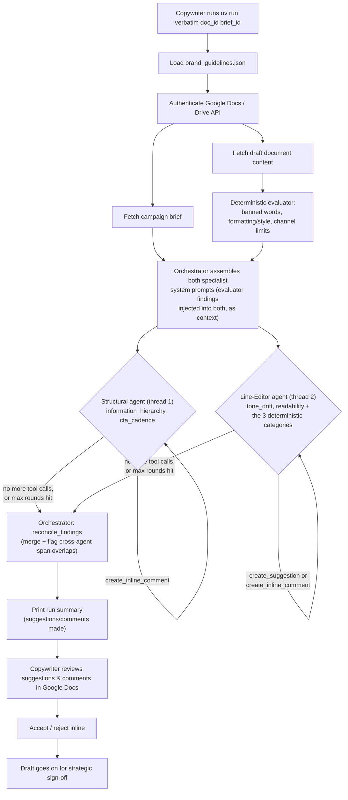

# Verbatim

Verbatim is an AI agent that reviews draft marketing copy inside Google Docs against a brand's voice, style, and structural guidelines and a campaign brief. It runs on-demand when a copywriter starts a check, then flags issues across 7 categories — tone drift, information hierarchy, CTA cadence, readability, formatting/style, channel constraints, and banned words — as inline comments and suggested edits directly in the document.

## Table of contents

- [Verbatim](#verbatim)
  - [Table of contents](#table-of-contents)
  - [Overview](#overview)
    - [How it works](#how-it-works)
    - [Design notes](#design-notes)
  - [Project status](#project-status)
    - [Current sprint](#current-sprint)
    - [Team & responsibilities](#team--responsibilities)
  - [Setup](#setup)
    - [Prerequisites](#prerequisites)
    - [macOS setup](#macos-setup)
    - [Windows setup](#windows-setup)
    - [Clone & bootstrap](#clone--bootstrap)
  - [Development](#development)
    - [Common commands](#common-commands)
    - [Development workflow](#development-workflow)
  - [Integrations](#integrations)
    - [Google Docs API setup](#google-docs-api-setup)
    - [Agent (Anthropic) setup](#agent-anthropic-setup)
  - [Usage](#usage)
    - [CLI usage](#cli-usage)
  - [Reference](#reference)
    - [Project structure](#project-structure)
    - [Versioning](#versioning)
    - [License](#license)

## Overview

### How it works

A copywriter kicks off a check from the command line (or, via the hosted backend, from the Google Docs sidebar Add-on) against a draft document and its campaign brief. From there the run is fully automated: Verbatim reads both documents once, runs its deterministic rule checks, then dispatches two specialist LLM agents concurrently on separate threads — each restricted to its own narrow slice of categories, writing to the same document under a per-document write lock — before a plain-Python orchestrator reconciles their output into one result and flags (without resolving) any spans where both agents independently raised an issue. If one specialist's thread fails, the other's already-live writes are still returned rather than discarded; only a failure of *both* aborts the run. Nothing is written until the copywriter reviews it.



The evaluator and the two specialist agents cover different slices of the 7 audit categories. `BrandGuidelinesEvaluator` handles the mechanically-checkable ones (banned words, formatting/style mechanics, channel constraints) with plain regex — its findings aren't discarded, they're injected into both agents' system prompts as a pre-verified `DETERMINISTIC FINDINGS` block. Only the **Line-Editor agent** acts on that block, though: it owns 5 of the 7 categories — tone drift and readability by its own subjective judgment (local, sentence-level rewrites), plus formatting/style, banned words/competitors, and channel constraints by transcribing the evaluator's pre-verified findings into a `create_suggestion` call (if the finding carries a fix) or a `create_inline_comment` call (if it doesn't). The **Structural agent** judges the remaining two categories — information hierarchy and CTA cadence (whole-document, paragraph-ordering reasoning) — and can only call `create_inline_comment`, since those issues call for reorganizing, not replacing, text; it never acts on the deterministic block, even though it's present in its context too. Each agent's `category` argument is validated server-side against its own allowed list (`validate_category`), so a category that belongs to the other specialist — or isn't real — falls back to `"uncategorized"` rather than corrupting the split. `agent.py`'s `run_agent()` dispatches the two on a `ThreadPoolExecutor` (each with its own `AnthropicClient` instance) and merges their results with `orchestrator.reconcile_findings`, which also flags (without resolving) any spans where both agents independently raised an issue — see `_find_cross_agent_overlaps`. `docs_client.py`'s write methods hold their own lock, since both specialists can end up writing to the same document from separate threads at once. Both specialist futures are always awaited: if exactly one thread raises, the survivor's real, already-posted output is still returned (with the failure recorded in `specialist_errors`) rather than discarded; only if *both* raise does the run fail outright. The original single-prompt, single-loop implementation is kept as `run_agent_legacy` for comparison. Full rationale: [`MULTI_AGENT_PLAN.md`](MULTI_AGENT_PLAN.md).

### Design notes

A few things about how this was built that might be worth stealing if you're building something similar:

- **Deterministic + LLM hybrid, not LLM-only.** Regex doesn't hallucinate a banned-word match, so `BrandGuidelinesEvaluator` handles every category that's pure pattern-matching without a model call at all. Its findings aren't discarded once computed — they're injected into the LLM's system prompt as pre-verified, citable evidence, so the model never has to *re-derive* a mechanical check a regex already nailed. For the 3 deterministic categories, the Line-Editor agent only has to transcribe each finding into a tool call; its actual judgment budget goes toward the 4 categories (tone drift, readability, information hierarchy, CTA cadence) that are genuinely subjective. Cheaper, faster, and more reliable than routing everything through the model.
- **The default guidelines are a real style guide, not a toy fixture.** `src/verbatim/data/brand_guidelines.json` is a synthesis of [Mailchimp's public Content Style Guide](https://styleguide.mailchimp.com/) — not a claim about Mailchimp's actual internal rules, just realistic, non-synthetic brand voice/style data to build and demo against. Point `-g/--guidelines` at a different file to audit against a different brand.
- **A knowledge base written for the coding agent, not just the team.** `.knowledge-base/` decomposes the Google Docs, Drive, OAuth2, Workspace Add-ons, and Anthropic REST references into map-and-leaf files (one `MAP.md` index plus a focused leaf per resource, each with a real request/response example and a "Gotchas" section). It exists so an AI coding agent implementing `docs_client.py` doesn't have to re-fetch Google's live docs — or worse, hallucinate a plausible-looking field name — every session. Scoped strictly to endpoints actually called; a new endpoint gets a new leaf rather than a cold read of the live reference.
- **"Suggested edit" requires Suggester access, not Editor.** `create_suggestion` only lands as a reviewable suggestion — the entire point, since nothing should reach the document unreviewed — if the authenticated account has Commenter/Suggester (not Editor) permission on the target doc. Editor access makes the identical API call apply the edit directly and silently instead. Found by testing against a live doc; it isn't called out anywhere obvious in Google's docs.
- **The narrower Drive scope 404s on this project's exact use case.** `drive.file` only covers files the app itself created or the user picked via a file picker — it 404s on `comments.create` for a doc a copywriter just opens by link, which is Verbatim's whole workflow. `WRITE_SCOPES` requests the broader `drive` scope instead, confirmed live rather than assumed from the scope reference.

## Project status

### Current sprint

See [`TODO.md`](TODO.md) for the active sprint plan — the current deadline, the day-by-day work split between Karl and Christina, and which files/components each of them (and their coding agents) should be working in.

### Team & responsibilities

Karl and Christina split ownership of the repo by domain, not by day-to-day task, so each of them can move fast without waiting on review of the other's in-flight work — the two stay in disjoint files at any given time:

- **Christina** owns the deterministic rules/evaluator engine: `src/verbatim/evaluator.py`, `src/verbatim/brand_guidelines.py`, `src/verbatim/data/brand_guidelines.json`, and their tests. This covers the mechanically-checkable brand rules — banned words, formatting/style mechanics, channel character/sentence limits, standardized spellings.
- **Karl** owns infrastructure/CI/tooling, the Google Docs/Drive API client (`src/verbatim/docs_client.py`), and the multi-agent orchestration and prompt assembly (`src/verbatim/agent.py`, `src/verbatim/orchestrator.py`, `src/verbatim/prompt.py`, `src/verbatim/prompts/`, `src/verbatim/cli.py`).

This split isn't permanent. Christina's domain was chosen deliberately: it's self-contained and regex/pattern-based with a fast TDD feedback loop, which gives her genuine ownership of core product logic rather than docs/config busywork. She'll rotate into Docs API and agent-loop territory in small, reviewed slices as time allows, rather than all at once. See [`TODO.md`](TODO.md) for the current sprint's day-by-day split and file ownership map.

## Setup

### Prerequisites

This project is managed end-to-end by [`uv`](https://docs.astral.sh/uv/), which installs and pins the right Python version for you — you do not need to install Python separately. You do need `git` and `uv` themselves; setup steps for each OS are below.

### macOS setup

1. Install [Homebrew](https://brew.sh) if you don't already have it.

1. Install git:

   ```sh
   brew install git
   ```

1. Install `uv`:

   ```sh
   curl -LsSf https://astral.sh/uv/install.sh | sh
   ```

1. Restart your terminal, then install the project's Python version:

   ```sh
   uv python install 3.12
   ```

### Windows setup

1. Install git via [winget](https://learn.microsoft.com/en-us/windows/package-manager/winget/):

   ```powershell
   winget install --id Git.Git -e --source winget
   ```

1. Install `uv` (official PowerShell installer):

   ```powershell
   powershell -ExecutionPolicy ByPass -c "irm https://astral.sh/uv/install.ps1 | iex"
   ```

1. Restart your terminal, then install the project's Python version:

   ```powershell
   uv python install 3.12
   ```

### Clone & bootstrap

```sh
git clone <repo-url>
cd verbatim
uv sync
uv run pre-commit install
```

`uv sync` creates a `.venv` and installs every dependency pinned in `uv.lock`. `uv run pre-commit install` wires up the local git hooks (code quality checks on every commit, commit message format checks on every commit message).

## Development

### Common commands

Run everything through `uv run` — there's no separate virtualenv to activate.

| Command                             | What it does                                                        |
| ----------------------------------- | ------------------------------------------------------------------- |
| `uv run pytest`                     | Run the test suite with coverage                                    |
| `uv run ruff check .`               | Lint the code                                                       |
| `uv run ruff format .`              | Auto-format the code                                                |
| `uv run mypy`                       | Type-check the code                                                 |
| `uv run pre-commit run --all-files` | Run every pre-commit hook against the whole repo                    |
| `uv run cz commit`                  | Build a Conventional Commits-formatted commit message interactively |

### Development workflow

This project follows **test-driven development**: write a failing test before writing the implementation code that makes it pass. Commit messages (and PR titles once this repo is on GitHub) follow the [Conventional Commits](https://www.conventionalcommits.org/) format (`feat: ...`, `fix: ...`, `chore: ...`, `docs: ...`) — the `commitizen` pre-commit hook enforces this locally, and `uv run cz commit` will build a properly formatted message for you.

## Integrations

### Google Docs API setup

`src/verbatim/docs_client.py` reads documents via the Google Docs API using an OAuth installed-app flow (not a service account — the copywriter checks their own currently-open document, so there's nothing to pre-share). One-time setup to run it locally:

1. Create or select a project in the [Google Cloud Console](https://console.cloud.google.com/).
1. Enable both the **Google Docs API** and the **Google Drive API** for that project — reading a document only needs the Docs API, but posting inline comments (`GoogleDocsClient.create_inline_comment`) goes through the Drive API instead (comments are a Drive resource, not a Docs one).
1. Configure the OAuth consent screen as **External**, in **Testing** mode, and add your own Google account as a test user.
1. Create an OAuth Client ID of type **Desktop app** — this matters, since the installed-app flow's local redirect handling (`InstalledAppFlow.run_local_server`) only works with this client type, not "Web application."
1. Download the client ID's JSON and save it as `client_secret.json` at the repo root (already git-ignored — never commit it).
1. Run anything that calls `GoogleDocsClient.from_local_credentials()`. The first run opens a browser consent prompt; afterward, a `token.json` is cached locally (also git-ignored) so you won't be prompted again until it expires or the requested scopes change. Read-only checks use the default scopes; to also post suggestions/comments, pass `scopes=WRITE_SCOPES, include_drive=True`. For a suggestion to land as a reviewable "Suggested edit" (rather than a silent direct edit), the authenticated account needs Commenter/Suggester — not Editor — access on the target document. `WRITE_SCOPES` requests full `drive` access rather than the narrower `drive.file` — confirmed live that `drive.file` 404s on `comments.create` for any doc the app didn't itself create/open (e.g. a doc opened by URL/link, which is Verbatim's whole use case), regardless of the user's own access to that doc.

See `.knowledge-base/google-docs-api/` and `.knowledge-base/google-drive-api/` for decomposed reference docs on the underlying REST APIs.

### Agent (Anthropic) setup

`src/verbatim/llm_client.py` runs the audit conversation through [Anthropic](https://www.anthropic.com/)'s native Messages API.

1. Create an Anthropic account (console.anthropic.com) and generate an API key.

1. Copy `.env.example` to `.env` and fill in your key:

   ```sh
   cp .env.example .env
   ```

   `AnthropicClient.from_env(...)` loads `.env` automatically (it's git-ignored — never commit it). Alternatively, export the variable in your shell instead:

   ```sh
   export ANTHROPIC_API_KEY="sk-ant-..."
   ```

   On Windows PowerShell: `$env:ANTHROPIC_API_KEY = "sk-ant-..."`.

## Usage

### CLI usage

Once bootstrapped and configured, you can run the Verbatim copy auditor directly from your command line:

```sh
uv run verbatim <document_id> <brief_id> [options]
```

#### Options

- `-c, --channel`: Optional target marketing channel (e.g. `email`, `blog`, `twitter`). If set, activates channel-specific rules in the evaluator.
- `-m, --model`: Claude model identifier (defaults to `claude-sonnet-5`).
- `-g, --guidelines`: Optional custom path to a `brand_guidelines.json` file.

Example:

```sh
uv run verbatim 1_abc123xyz 1_brief456abc --channel email
```

### HTTP usage

The same audit logic is also exposed over HTTP, as the backend for the Workspace Add-on (see `docs/workspace-addon-migration.md`) — deployed as a Cloud Run service (`verbatim-backend`), with the Add-on itself pushed to a real Apps Script project; only a final manual browser end-to-end test is still outstanding. This is additive, not a replacement: `cli.py`/`uv run verbatim` above remains the local-dev/direct-run entrypoint.

```sh
uv run verbatim-server
```

This requires `GOOGLE_OAUTH_CLIENT_ID` and `BACKEND_SHARED_SECRET` to be set (alongside `ANTHROPIC_API_KEY`, in the same `.env`). `GOOGLE_OAUTH_CLIENT_ID` is the audience inbound bearer tokens are expected to carry, checked against Google's tokeninfo endpoint before any request is trusted — see `src/verbatim/token_validator.py`. `BACKEND_SHARED_SECRET` is a static secret the caller must also present on every request, checked first as a cheap filter against internet scanning/probing, before that (more expensive) tokeninfo call ever happens.

This starts a FastAPI app (via uvicorn) on `PORT` (default `8080`). An audit is a submit-then-poll pair, not one blocking call: `UrlFetchApp.fetch()` on the Apps Script side has a hard, non-configurable 60-second timeout that a real audit (an LLM tool-calling loop of up to 20 round trips) routinely exceeds, so `POST /audit` returns a job id immediately and the caller polls `GET /audit/{job_id}` for the outcome.

```sh
# 1. Submit the job -- returns 202 Accepted with a job id right away
curl -X POST http://localhost:8080/audit \
  -H "Authorization: Bearer <google-oauth-access-token>" \
  -H "X-Backend-Shared-Secret: <shared-secret>" \
  -H "Content-Type: application/json" \
  -d '{"document_id": "1_abc123xyz", "brief_id": "1_brief456abc", "channel": "email"}'
# => {"job_id": "..."}

# 2. Poll until status is "done" or "error"
curl http://localhost:8080/audit/<job_id> \
  -H "X-Backend-Shared-Secret: <shared-secret>"
# => {"job_id": "...", "status": "done", "result": {...}, "error": null}
```

Unlike the CLI (which authenticates via a local OAuth consent flow, caching a token to `token.json`), `POST /audit` expects the caller to already hold a valid Google OAuth access token and forward it in the `Authorization` header — see `GoogleDocsClient.from_access_token()`. That token is validated against Google's tokeninfo endpoint (audience and required scope) before it's trusted. `GET /audit/{job_id}` only re-checks the shared secret — no fresh Docs/Drive write happens there, since those already happened (or didn't) during the background job. The job store is a plain in-process dict, which only works because the deployed service is pinned to a single instance (`--min-instances=1 --max-instances=1`, no extra uvicorn/gunicorn workers) — see `docs/workspace-addon-migration.md` for the full deployment rationale, including why `--no-cpu-throttling` is also required for the background job to actually make progress between polls.

## Reference

### Project structure

```text
verbatim/
├── .github/
│   ├── CODEOWNERS
│   ├── dependabot.yml
│   ├── ISSUE_TEMPLATE/
│   ├── pull_request_template.md
│   └── workflows/
│       ├── ci.yml          # lint, type-check, and test on every PR and push to main
│       └── release.yml     # semver bump + changelog + tag + GitHub Release on merge to main
├── src/verbatim/           # the installable package
│   ├── __init__.py
│   ├── __main__.py         # runnable module entrypoint
│   ├── agent.py            # run_agent (multi-agent split) + run_agent_legacy entrypoints
│   ├── orchestrator.py     # per-specialist dispatch loop + reconcile_findings merge
│   ├── brand_guidelines.py # loader for brand_guidelines.json
│   ├── cli.py              # CLI entrypoint implementation
│   ├── docs_client.py      # Google Docs/Drive API auth + read/write tool wrappers
│   ├── evaluator.py        # BrandGuidelinesEvaluator: checks text against brand rules
│   ├── http_api.py         # FastAPI HTTP entrypoint (hosted Workspace Add-on backend)
│   ├── llm_client.py       # Anthropic Messages API client
│   ├── prompt.py           # legacy single-agent system prompt + tool schemas
│   ├── prompts/            # per-specialist-agent prompt assembly + tool schemas
│   │   ├── shared.py       # CATEGORIES, validate_category() -- shared by every agent
│   │   ├── structural.py   # Structural agent: information hierarchy, CTA cadence
│   │   └── line_editor.py  # Line-Editor agent: tone drift, readability + 3 deterministic categories
│   ├── py.typed
│   ├── token_validator.py  # validates inbound Add-on bearer tokens (tokeninfo)
│   └── data/
│       └── brand_guidelines.json  # brand voice/style rules (Mailchimp style guide synthesis)
├── tests/                  # pytest suite
│   ├── test_agent.py
│   ├── test_orchestrator.py
│   ├── test_cli.py
│   ├── test_docs_client.py
│   ├── test_evaluator.py
│   ├── test_brand_guidelines.py
│   ├── test_http_api.py
│   ├── test_llm_client.py
│   ├── test_prompt.py
│   ├── test_prompts_shared.py
│   ├── test_prompts_structural.py
│   ├── test_prompts_line_editor.py
│   ├── test_token_validator.py
│   └── test_version.py
├── addon/                  # Editor Add-on source (Apps Script) -- see addon/README.md
│   ├── appsscript.json     # manifest: runtime, oauthScopes, Docs Editor Add-on config
│   ├── Code.gs             # homepage trigger + CardService sidebar UI
│   ├── Backend.gs          # UrlFetchApp submit/poll calls to the Python backend
│   ├── icon.png            # sidebar icon
│   ├── .clasp.json         # clasp deploy target (the standalone Apps Script project)
│   └── README.md           # Add-on setup: Script Properties, clasp push/deploy
├── presentation/           # demo-day deck + fixtures (not part of the installable package)
│   ├── PRESENTATION_PLAN.md
│   ├── build_deck.py       # generates the demo deck from PRESENTATION_PLAN.md
│   ├── verify_deck.py      # structural sanity check on the generated deck
│   └── demo/               # sample briefs/drafts + their expected findings, per scenario
├── .knowledge-base/        # decomposed reference docs for external APIs (map-and-leaf)
├── docs/                   # PRD/research docs (.docx + Markdown snapshots) + workspace-addon-migration.md
├── .env.example            # ANTHROPIC_API_KEY/GOOGLE_OAUTH_CLIENT_ID/BACKEND_SHARED_SECRET template; copy to .env (git-ignored)
├── .dockerignore
├── BOOTSTRAPPING.md        # scaffolding rationale and remaining setup work
├── CHANGELOG.md            # auto-generated by `cz bump` on every merge to main
├── CLAUDE.md               # project context for AI coding agents
├── CODE_OF_CONDUCT.md
├── CONTRIBUTING.md
├── Dockerfile              # builds verbatim-server for Cloud Run (not the CLI)
├── ENHANCEMENT_IDEAS.md    # optional post-demo backlog
├── LICENSE                 # MIT
├── MULTI_AGENT_PLAN.md     # full rationale for the Structural/Line-Editor split
├── SECURITY.md
├── TEST_PLAN.md
├── TODO.md                 # live sprint plan + Karl/Christina file ownership map
├── pyproject.toml          # project metadata + all tool configuration
└── uv.lock                 # pinned dependency versions
```

### Versioning

Versioning is fully automatic: `.github/workflows/release.yml` runs `commitizen` on every merge to `main`, bumping the semver version (from Conventional Commits history), regenerating `CHANGELOG.md`, tagging the commit, and cutting a GitHub Release. There's no manual version bump step — see `BOOTSTRAPPING.md` for the rationale.

### License

[MIT](LICENSE).
